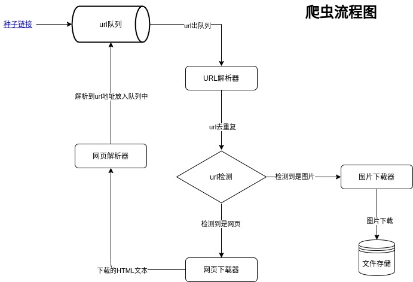

# Spider4j
> Spider4j 是一个多线程的爬虫系统，这是个学习项目，功能比较简单

### 运行要求
- Java 环境：jdk-14
### 技术栈
- 依赖管理：maven 3.6.2
- 基础框架：Spring boot 2.3.2.RELEASE

### 整体流程图

### 编写本程序的目标
学习java,最后实现图片爬虫程序

### 功能模块
- URL队列管理器：包含三种队列（原始url队列，图片url队列，网页url队列）
   - 核心知识点：多线程队列
- URL解析器：从队列中取url,去重，将不同类型的url推送给不同的处理队列（图片url队列，网页url队列）
   - 核心功能点：URL去重算法
- 图片下载器：从图片url队列拿到图片url，下载图片到磁盘
   - 核心知识点：IO、文件系统
- 网页下载器：从网页url队列拿到网页url，下载html文档
   - 核心知识点：IO
- 网页解析器：从网页下载器拿到html文档，提取网页中的url
   - 核心知识点：Html文档解析，正则表达式等